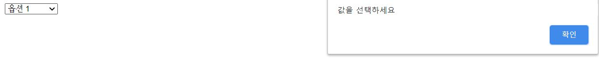

alert : 알림 팝업(경고)
===

1 /

```html
<!DOCTYPE html>
<html>
<head>
    <meta charset="UTF-8">
    <title>Document</title>
</head>
<body>
<script>
    var date = new Date();
    var hour = date.getHours();

    if(hour < 12) {
        alert("오전입니다");
    }

    if (hour >=12)
    {
        alert("오후입니다");
    }
</script>
</body>
</html>
```


2 /

```html
<!DOCTYPE html>
<html>
<head>
    <meta charset="UTF-8">
    <title>Document</title>
</head>
<body>
<script>
    var input = Number(prompt("숫자를 입력하세요:","숫자"));

    switch (input %2)
    {
        case 0:
            alert("짝수입니다");
            break;
        case 1:
            alert("홀수입니다");
            break;
        default:
            alert("숫자가 아닙니다");
            break;
    }
</script>
</body>
</html>
```


3 /

```html
<!DOCTYPE html>
<html>
<head>
    <meta charset="UTF-8">
    <title>Document</title>
</head>
<body>
<script>
    var output = "";

    for (var i=0; i<10 ;i++ )
    {
        for (var j = 10;j>i ;j-- )
        {
            output += ' ';
        }

        for (var j=0;j<2*i-1 ;j++ )
        {
            output += "*";
        }
        output += "\n";
    }

    alert(output);
</script>
</body>
</html>
```


---

checkbox
===

4 /

```html
<!DOCTYPE html>
<html>
<head>
    <meta charset="UTF-8">
    <title>Document</title>
</head>
<body>
<script>
    function fx1(){
        var f = window.document.checkform;
        var tt = "지금은 ";

        for (var i = 1; i< 6; i++)
        {
            if (eval("f.count"+ i +".checked"))
            {
                tt += i + "번 체크박스 ";
            }
        }

        tt += "가 선택되었습니다";

        alert(tt);
    }
</script>

<form name="checkform">
    <input type = "checkbox" name = "count1" value = "1" /> count 1 <br/>
    <input type = "checkbox" name = "count2" value = "2" /> count 2<br/>
    <input type = "checkbox" name = "count3" value = "3" /> count 3<br/>
    <input type = "checkbox" name = "count4" value = "4" /> count 4<br/>
    <input type = "checkbox" name = "count5" value = "5" /> count 5
    <br/>
    <br/>
    <input type = "button" value = "confirm" onclick ="fx1()"/>
</form>
</body>
</html>
```


5 /

```html
<!DOCTYPE html>
<html>
<head>
    <meta charset="UTF-8">
    <title>Document</title>
</head>
<body>
<script>
    function fx1() {
        var f = window.document.checkform;
        var my_sum = 0;
        var tt = "총 값의 합은 ";
        for (var i = 1; i < 6; i++) {
            if (eval("f.count" + i + ".checked")) {
                my_sum += parseInt(eval("f.count" + i + ".value"));
            }
        }
        tt += my_sum + "입니다";
        alert(tt);
    }
</script>
<form name="checkform">
    <input type="checkbox" name="count1" value="1"/>count 1 <br/>
    <input type="checkbox" name="count2" value="2"/>count 2<br/>
    <input type="checkbox" name="count3" value="3"/>count 3<br/>
    <input type="checkbox" name="count4" value="4"/>count 4<br/>
    <input type="checkbox" name="count5" value="5"/>count 5 <br/> <br/>
    <input type="button" value="confirm" onclick="fx1()"/>
</form>
</body>
</html>

```


6
===

```html
<!DOCTYPE html>
<html>
<head>
    <meta charset="UTF-8">
    <title>Document</title>
</head>
<body>
<script>
    function fx1() {
        var f = window.document.checkform;
        var my_sum = 0;
        var a = f.count.length;
        var tt = "총 값의 합은 ";

        for (var i = 0; i < a; i++) {
            if (f.count[i].checked) {
                my_sum += parseInt(f.count[i].value);
            }
        }

        tt += my_sum + "입니다";

        alert(tt);
    }
</script>

<form name="checkform">
    <input type="checkbox" name="count" value="1"/> count 1 <br/>
    <input type="checkbox" name="count" value="2"/> count 2<br/>
    <input type="checkbox" name="count" value="3"/> count 3<br/>
    <input type="checkbox" name="count" value="4"/> count 4<br/>
    <input type="checkbox" name="count" value="5"/> count 5
    <br/>
    <br/>
    <input type="button" value="confirm" onclick="fx1()"/>
</form>
</body>
</html>

```


---

option
===

7 /

```html
<!DOCTYPE html>
<html>
<head>
    <meta charset="UTF-8">
    <title>Document</title>
</head>
<body>
<script>
    var fx1 = function(){
        var f = document.checkform;
        if(f.my_sel.value)
        {
            alert("selected option : " + f.my_sel.value);
        }
    }
</script>

<form name="checkform">
    <select name = "my_sel">
        <option value = "opt1"> 옵션 1 </option>
        <option value = "opt2"> 옵션 2 </option>
        <option value = "opt3"> 옵션 3 </option>
        <option value = "opt4"> 옵션 4 </option>
        <option value = "opt5"> 옵션 5 </option>
    </select>
    <br/>
    <br/>
    <input type = "button" value = "confirm" onclick ="fx1()"/>
</form>
</body>
</html>
```


8
===

```html
<!DOCTYPE html>
<html>
<head>
    <meta charset="UTF-8">
    <title>Document</title>
</head>
<body>
<script>
    var fx1 = function(){
        var f = document.checkform;
        if(f.my_sel.value)
        {
            alert("selected option : " + f.my_sel.value);
        }
        else
        {
            alert("값을 선택하세요");
        }
    }
</script>

<form name="checkform">
    <select name = "my_sel" >
        <option value = ""> 선택하세요</option>
        <option value = "opt1"> 옵션 1 </option>
        <option value = "opt2"> 옵션 2 </option>
        <option value = "opt3" selected> 옵션 3 </option>
        <option value = "opt4"> 옵션 4 </option>
        <option value = "opt5"> 옵션 5 </option>

    </select>
    <br/>
    <br/>
    <input type = "button" value = "confirm" onclick ="fx1()"/>
</form>
</body>
</html>
```


9 /

```html
<!DOCTYPE html>
<html>
<head>
    <meta charset="UTF-8">
    <title>Document</title>
</head>
<body>
<script>
    var fx1 = function(){
        var f = document.checkform;
        if(f.my_sel.value)
        {
            alert("selected option : " + f.my_sel.value);
        }
        else
        {
            alert("값을 선택하세요");
        }
    }
</script>

<form name="checkform">
    <select name = "my_sel" onchange = "fx1()" >
        <option value = ""> 선택하세요</option>
        <option value = "opt1"> 옵션 1 </option>
        <option value = "opt2"> 옵션 2 </option>
        <option value = "opt3" selected> 옵션 3 </option>
        <option value = "opt4"> 옵션 4 </option>
        <option value = "opt5"> 옵션 5 </option>
    </select>
    <br/>
    <br/>
</form>
</body>
</html>
```



---

10
===

```html
<!DOCTYPE html>
<html>
<head>
    <meta charset="UTF-8">
    <title>Document</title>
</head>
<body>
<script>
    var fx1 = function(){
        var f = document.checkform;
        if(f.my_sel.value)
        {
            // alert("selected option : " + f.my_sel.value);
            f.my_input.value = f.my_sel.value;
        }
        else
        {
            alert("값을 선택하세요");
            f.my_input.value = "";
        }
    }
</script>

<form name="checkform">
    <select name = "my_sel" onchange = "fx1()" >
        <option value = ""> 선택하세요</option>
        <option value = "opt1"> 옵션 1 </option>
        <option value = "opt2"> 옵션 2 </option>
        <option value = "opt3" selected> 옵션 3 </option>
        <option value = "opt4"> 옵션 4 </option>
        <option value = "opt5"> 옵션 5 </option>
    </select>
    <br/>
    <br/>
    <input type="text" name="my_input" />
</form>
</body>
</html>
```


---

11
===

```html
<!DOCTYPE html>
<html>
<head>
    <meta charset="UTF-8">
    <title>Document</title>
</head>
<body>
<script>
    var fx1 = function(){
        var f = document.checkform;
        if(f.my_radio.value == "m")
        {
            alert(" 당신은 남성을 선택하였습니다. " );
        }
        else if (f.my_radio.value == "f")
        {
            alert(" 당신은 여성을 선택하였습니다. " );
        }
        else
        {
            alert(" 선택해 주세요!!" );
        }
    }
</script>

<form name="checkform">
    <input type = "radio" name ="my_radio" value ="m" checked /> 남성
    <input type = "radio" name ="my_radio" value ="f" /> 여성
    <br/>
    <br/>
    <input type="button" name="my_button" value = "선택" onclick = "fx1()" />
</form>
</body>
</html>
```


